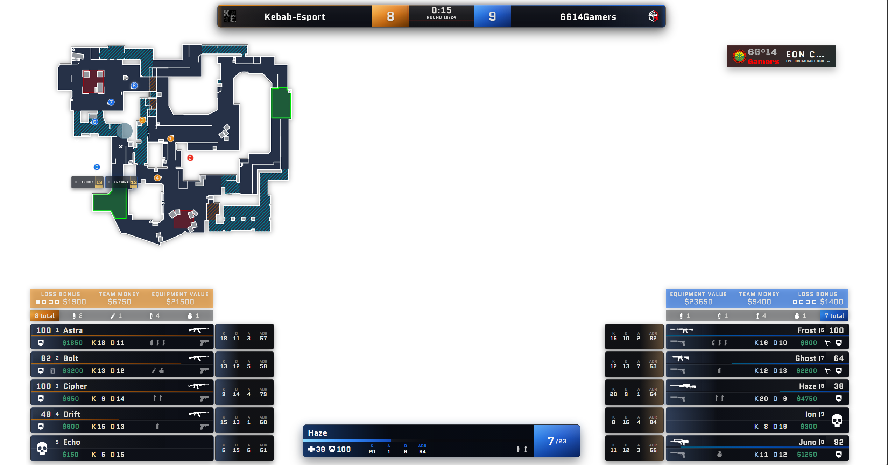

# NeuronCast

NeuronCast is a next-generation broadcast HUD and production suite for Counter-Strike 2 — delivering the clean on-screen overlays seen on top-tier tournament streams: live team scores, round timers, player health/armor/economy sidebars, utility tracking, radar, win probability forecasting, and tournament intermission scenes. It is architected for LAN tournaments, online leagues, and solo broadcast stations where a caster or producer manages production from a web-based control panel while OBS or vMix captures transparent overlay sources.



Everything runs locally with zero external telemetry requirements. CS2 streams game state directly to NeuronCast over Valve's Game State Integration (GSI); NeuronCast validates, normalizes, and enriches that state (win probability models, economy metrics, caster alerts, killfeed events, match telemetry) and broadcasts it via WebSocket to real-time client surfaces:

- **Live HUD** (`/hud`) — the viewer-facing broadcast overlay, rendered as a transparent HTML5 canvas/DOM layer for OBS/vMix browser sources or click-through desktop Electron windows.
- **Control Panel** (`/config`) — a responsive Vue 3 SPA for the operator: switch live scenes, set up tournament formats (BO1/BO3/BO5), manage player stand-ins, draw on the telestrator, adjust themes, configure sponsors, and audit broadcast readiness.
- **Match Platforms Hub** (`/config` -> Platforms) — dedicated platform integrations (Fastcup, Komplettligaen / GG Arena, Standalone) to sync tournament brackets, rosters, and player avatars.
- **Standalone Radar** (`/radar`) — an isolated, high-resolution top-down map view with synchronized player positions and grenade trajectories.
- **Operator Readiness & Telemetry** (`/operator/readiness`, `/api/sessions/active`) — real-time system diagnostics, GSI signal latency, WebSocket client counts, and live CSV/JSON match telemetry export.
- **Mobile Remote (Planned)** (`/remote`) — low-bandwidth mobile controller with blind haptic feedback and Screen Wake Lock designed for single-monitor caster setups.

---

## Key Features

- **High-Frequency GSI Processing**: Ingests CS2 Game State Integration packets at ~20Hz with zero UI stutter.
- **Dynamic Visual Themes & Presets**: Five built-in presets (Slanted, Classic, Compact, Diagonal, Rounded) with full CSS variable customization via Theme Designer.
- **Modular Tournament Platforms**: Decoupled platform hub supporting Komplettligaen (GG Arena) and Fastcup sync alongside standalone manual operations.
- **Telemetry & Match Session Logger**: Automatically records round histories, kill timelines, player K/D/A/MVP stats, bomb plants/defuses, and exports complete match logs to CSV and JSON.
- **Broadcast Readiness Diagnostics**: Real-time preflight checks validating GSI connection, team identity resolution, package health, and connected HUD clients.
- **Interactive Telestrator (Analysis Board)**: Freehand tactical drawing directly overlaid on top of the live match view with instant HUD sync.
- **Offline-Safe Asset Guarantees**: Enforces local font and image serving — strictly eliminating render-blocking external Google Fonts or CDN downtime during live LAN broadcasts.
- **Cross-Platform Launchers**: Electron wrappers for desktop window management and background system trays.
- **UI Development Sandbox**: Built-in frozen in-round state simulation (`--ui-dev-mode`) allowing complete design tweaking without CS2 running.

---

## Control Panel

The operator drives the broadcast from the Vue 3 config interface at `http://127.0.0.1:31982/config`:

- **Live Control & Scenes**: Instant scene switching (Live HUD, Full Radar, Match Overview, Waiting, Results, Table/Form), win celebration triggers, and promotion panels.
- **Match Platforms**: Dedicated hub for configuring Fastcup matches, Komplettligaen IDs, local cache diagnostics, or standalone operation.
- **Teams & Overrides**: Team names, sponsor logos, country flags, player name/subtitle remaps, and observer hiding.
- **Series & Maps**: Series format (BO1/BO3/BO5), map vetoes, pick designations, and map scores.
- **Theme Designer**: Real-time theme editor with typography, color palettes, slants, glassmorphism opacities, and live preview.
- **Layout Editor**: Micro-adjust screen anchors, margins, widths, and safe zones.
- **Telemetry Sessions**: Inspect live fragger leaderboards, timeline event logs, and export match data.

---

## Quick Start

### 1. Installation

Requires **Node.js 18+** (Node.js 20+ or 22+ recommended).

```bash
git clone https://github.com/stipic159/neuroncast.git
cd neuroncast
npm install
npm start
```

### 2. CS2 GSI Configuration

Copy `gamestate_integration_neuroncast.cfg` from the repository root into your Counter-Strike 2 configuration folder:

```text
<SteamLibrary>/steamapps/common/Counter-Strike Global Offensive/game/csgo/cfg/gamestate_integration_neuroncast.cfg
```

Restart CS2 or execute `exec gamestate_integration_neuroncast` in the CS2 developer console.

### 3. OBS / vMix Setup

1. Add a **Browser Source** in OBS Studio.
2. Set URL to: `http://127.0.0.1:31982/hud?transparent`
3. Set Width: `1920`, Height: `1080`.
4. Check **Shutdown source when not visible** and **Refresh browser when scene becomes active**.

---

## Available Commands & Scripts

```powershell
# Server & Development
npm start                # Start backend server on port 31982
npm run dev              # Start backend server with nodemon auto-reload
npm run start:ui-dev     # Start server in UI dev mode (frozen match state, no CS2 needed)
npm run broadcast:start  # Production startup script with health checks

# Desktop Electron Windows
npm run overlay          # Transparent, click-through HUD overlay window
npm run config           # Standalone operator control panel window
npm run radar            # Standalone map radar window
npm run start:broadcast  # Concurrently launches Server + Overlay + Radar

# Testing & Quality Assurance
npm run test:unit        # Run Node.js native unit test suites
npm run theme:validate   # Validate themes, canonical CSS variables, and radar definitions
npm run test:smoke       # Playwright browser smoke test suite
npm run gsi:simulate     # Stream simulated CS2 GSI packets for testing
```

---

## Network Endpoints & Ports

Default Port: **`31982`** (Configurable via `PORT` environment variable)

| Route | Purpose | Target Audience |
| :--- | :--- | :--- |
| `http://127.0.0.1:31982/` | Welcome & quick link launcher | Operator / Broadcast Team |
| `http://127.0.0.1:31982/hud` | Viewer-facing Broadcast HUD (`?transparent`) | OBS / vMix / Casters |
| `http://127.0.0.1:31982/config` | Operator Dashboard & Studio Control Panel | Producer / Observer |
| `http://127.0.0.1:31982/radar` | Dedicated full-screen tactical radar | Analysis Desk / Replay |
| `http://127.0.0.1:31982/operator/readiness` | System health & GSI preflight check | Technical Director |
| `http://127.0.0.1:31982/api/sessions/active` | Live match telemetry & fragger statistics | Graphics / Lower Thirds |
| `http://127.0.0.1:31982/gsi` | Valve GSI HTTP ingestion endpoint | CS2 Game Client |

---

## Architecture & Directory Structure

```text
neuroncast/
├── gamestate_integration_neuroncast.cfg  # Valve CS2 GSI config template
├── scripts/                              # Validation, simulation, and startup scripts
├── src/
│   ├── config/                           # Vue 3 Operator Dashboard SPA
│   │   ├── components/                   # Dashboard, Platforms, Themes, Layouts
│   │   ├── locales/                      # English (en) and Russian (ru) catalogs
│   │   └── store.js                      # Reactive state synchronized via WebSocket
│   ├── electron/                         # Electron desktop launchers
│   ├── radar/                            # Full-screen radar implementation
│   ├── server/                           # Koa.js backend, GSI router, telemetry logger
│   └── themes/
│       ├── raw/                          # Base parser and WebSocket client foundations
│       ├── default/                      # Built-in broadcast theme and SVG/PNG radar assets
│       └── userspace/                    # User-customized overrides and uploaded fonts/logos
└── tests/
    └── unit/                             # Node.js test runner unit test suites
```

---

## Environment Variables

| Variable | Default | Description |
| :--- | :--- | :--- |
| `PORT` | `31982` | HTTP and WebSocket server listening port. |
| `HOST` | `127.0.0.1` | Network interface binding (`0.0.0.0` for LAN access). |
| `NEURON_CONTROL_TOKEN` | `""` | Optional authorization bearer token for operator endpoints. |
| `GSI_TOKEN` | `""` | Expected GSI authentication token configured in CS2. |
| `NEURON_UI_DEV_MODE` | `0` | Set to `1` to freeze match state for offline theme/layout editing. |

---

## Internationalization (i18n)

The control panel features full bilingual support for **English** and **Russian**. Operators can toggle language dynamically in the panel header without reloading or affecting the broadcast HUD.

---

## License

ISC License. Built for the competitive Counter-Strike broadcast community.
